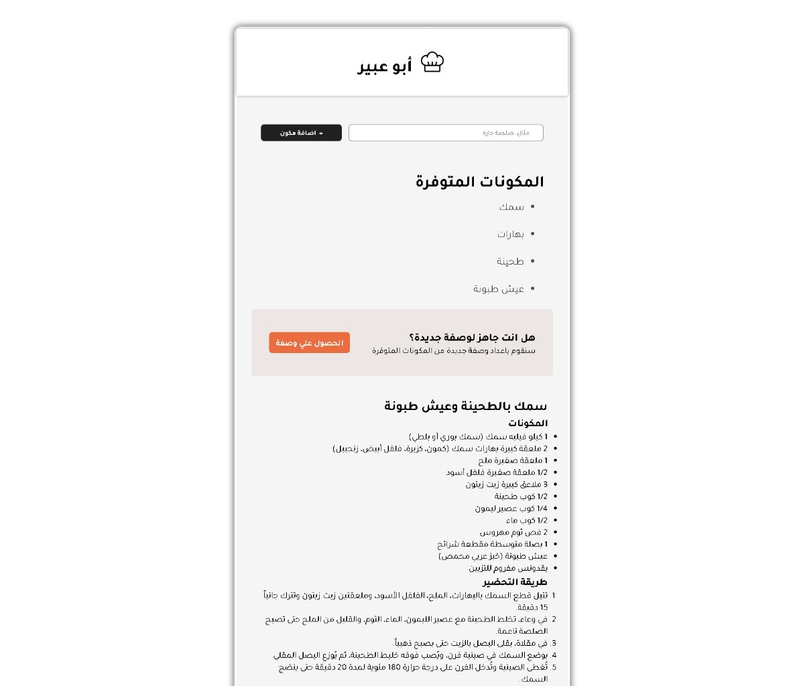

# AI Recipe Generator

A full-stack AI-powered recipe generator. Users input ingredients via a React frontend, which sends them to a FastAPI backend. The backend uses LangChain with Perplexity API to generate recipes formatted in JSX/HTML, supporting Arabic output.

-----
## Screen Shot


----
## Tools used in this project
1. Python
2. FastAPI
3. JavaScript
4. React.js
5. Perplexity API
---
## Installation 
1. Clone the repo to your local machine.
```bash
git clone https://github.com/Animo-GD/Chief-AI.git
cd Chief-AI
```
2. Install [Docker Desktop](https://www.docker.com/products/docker-desktop/)
3. Build the docker image
```bash
docker compose build
```
4. Run the docker container
```bash
docker compose up
```

5. Open the App from this url
[http://localhost:5173/](http://localhost:5173)


